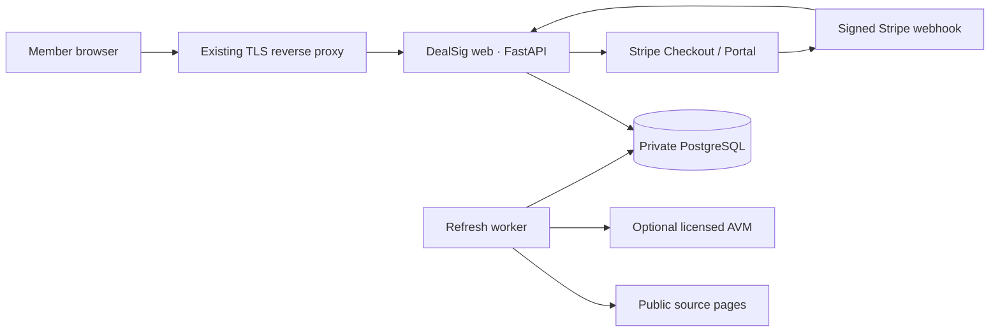

# DealSig AI MVP

DealSig AI is a source-linked research workspace for government, bank-owned, forfeiture, and Chicagoland tax-sale real estate. The MVP monitors public source pages, normalizes opportunities, separates direct sales from tax liens, models conservative economics, and tells a member where the official transaction happens.

The uploaded `DealSigAI.PNG` and `DealSigAI_Dark.PNG` assets are served directly by the application. The dark treatment is used on the landing header, app sidebar, and footer; the light treatment is used on white surfaces. Both source assets remain unaltered.

## What is implemented

- Public landing, passwordless email-code authentication through Resend, optional Google/Microsoft/Apple SSO and passkeys, preview paywall, and Pro member experience.
- Stripe subscription Checkout, signed/idempotent webhooks, subscription-state enforcement, and Stripe customer portal.
- Ranked deal feed with search, county/source/instrument filters, deadline sorting, and watchlist.
- Deal brief with official source, contact, source-specific purchase steps, anti-fraud payment boundary, and due-diligence checklist.
- Editable underwriting lab. Direct purchases use flip economics; Illinois tax liens use a separate redemption-return scenario and never imply that paying taxes buys the house.
- Public-page adapters for Treasury, GSA Real Estate Sales, and GovDeals, plus change monitors for FDIC, U.S. Marshals, and Cook, Will, Kane, Lake, DuPage, McHenry, and Kendall County sale pages.
- Per-source collection intervals, a one-click queued refresh, deduplication, change fingerprints, source health, and refresh audit trail.
- Optional licensed AVM integration. No value is invented when a provider is absent; live deals remain visibly unscored.
- FastAPI web service, independent refresh worker, private PostgreSQL, Docker Compose, health checks, non-root/read-only containers, tests, static analysis, and dependency audit.

Demo rows are explicitly labeled `DEMO` and link to the underlying source home page. They are illustrative product scenarios, not active offerings.

## Architecture



DealSig handles membership payments only. It never takes custody of earnest money, auction deposits, bid funds, or purchase proceeds.

## Run locally without Docker

Python 3.12+ is required.

```bash
python3 -m venv .venv
.venv/bin/pip install -r requirements-dev.txt
cp .env.example .env
.venv/bin/uvicorn app.main:app --reload --port 8080
```

Open [http://localhost:8080](http://localhost:8080). In development, choose **Explore the demo**, or sign in with:

- Email: `demo@dealsig.ai`

When `DEMO_MODE=true` and no Resend key is configured, the one-time code is shown only on the local sign-in screen so development does not send email. Production refuses to start with demo mode, billing bypass, or missing Resend credentials.

## Run with Docker Compose

```bash
cp .env.example .env
# Replace POSTGRES_PASSWORD and SESSION_SECRET first.
docker compose config
docker compose up --build -d
bash scripts/smoke-test.sh
```

The web port binds to `127.0.0.1:8080` by default, Postgres has no host port, and the project uses the explicit Compose project name `dealsig`. This prevents accidental collisions with other Compose stacks on the VPS.

For a real deployment, set at least:

```dotenv
APP_ENV=production
BASE_URL=https://dealsig.ai
ALLOWED_HOSTS=dealsig.ai,www.dealsig.ai
COOKIE_SECURE=true
COOKIE_SAME_SITE=lax
DEMO_MODE=false
BILLING_BYPASS=false
SEED_DEMO_DATA=false
SESSION_SECRET=<openssl rand -hex 32 output>
POSTGRES_PASSWORD=<unique strong password>
RESEND_API_KEY=re_...
RESEND_FROM_EMAIL="DealSig AI <access@dealsig.ai>"
STRIPE_SECRET_KEY=sk_live_...
STRIPE_WEBHOOK_SECRET=whsec_...
STRIPE_PRICE_ID=price_...
```

Keep the default loopback binding and proxy `https://dealsig.ai` to `http://127.0.0.1:8080` from the host's existing Caddy, Nginx, or Traefik. The proxy should set `Host`, `X-Forwarded-Proto`, and `X-Forwarded-For`, enforce HTTPS, and add an outer request-rate limit. Back up the `dealsig_dealsig-postgres` volume.

## Stripe setup

1. Create a recurring DealSig Pro Product/Price in a Stripe sandbox and set its `price_...` ID.
2. Enable the Stripe customer portal and allow the desired cancellation/invoice features.
3. Register `https://dealsig.ai/webhooks/stripe` as a webhook endpoint.
4. Subscribe it to `checkout.session.completed`, `customer.subscription.created`, `customer.subscription.updated`, `customer.subscription.deleted`, and `invoice.payment_failed`.
5. Set the endpoint's `whsec_...` secret. DealSig verifies the raw request body and `Stripe-Signature` before changing access.
6. Exercise subscription, failed-payment, cancellation, and replay/idempotency cases in Stripe test mode before switching keys.

Card data never reaches the DealSig application; Checkout and the customer portal are Stripe-hosted.

## Passwordless authentication and Resend

1. Add and verify `dealsig.ai` in Resend, including the DNS records Resend supplies.
2. Create a sending-only API key in Resend.
3. Paste that secret after `RESEND_API_KEY=` in `.env`; do not put it in source code or commit `.env`.
4. Keep `RESEND_FROM_EMAIL` on the verified domain. The included default is `DealSig AI <access@dealsig.ai>`.
5. Set `BASE_URL`, `PASSKEY_RP_ID=dealsig.ai`, and `PASSKEY_ORIGIN=https://dealsig.ai` in production.

Codes expire after 10 minutes, are single-use, have a five-attempt ceiling, and are stored only as keyed hashes. Request limits apply by email and IP. The **Resend code** button requests a new code and immediately invalidates every previous unused code for that address.

Google, Microsoft, and Apple buttons remain disabled until their client ID and client secret variables are configured. Social identities never auto-link to an existing same-email account; the member must first authenticate by email to prevent account takeover. Passkeys require a verified HTTPS origin in production. Apple `form_post` callbacks require `COOKIE_SAME_SITE=none`; use that only with `COOKIE_SECURE=true`.

## Source ingestion behavior

| Source | MVP behavior | Target cadence |
|---|---|---:|
| U.S. Treasury real property | Parses public auction entries | 15 min |
| GSA Real Estate Sales | Parses public auction cards | 15 min |
| GovDeals real estate | Parses public SEO listing cards | 15 min |
| FDIC real estate | Monitors official calendar/listing-page changes | 60 min |
| U.S. Marshals asset forfeiture | Monitors official page changes | 60 min |
| Cook, Will, Kane, Lake, DuPage, McHenry, Kendall | Monitors official sale/calendar pages | 180 min |

The worker sweeps once per minute and refreshes only sources whose own interval is due. A member can queue an immediate source or full refresh; per-user rate limits prevent the button from turning into a source hammer.

Connectors use conditional requests where a source provides an ETag, bounded timeouts, a named user agent, and no login/CAPTCHA bypass. Parcel lists that are sold, access-controlled, or licensed for a limited purpose are not scraped by the MVP. In particular, Lake County states that its purchased delinquent list is for tax-sale use; the connector therefore monitors the official information page only.

Government sites change. Treat HTML adapters as monitored integrations: alert on failure/zero-record changes, preserve fixtures, and have a human confirm parser changes before shipping them.

### Optional market-value provider

Configure a licensed provider or an internal adapter with:

```dotenv
MARKET_DATA_API_URL=https://avm-adapter.example.com/valuation
MARKET_DATA_API_KEY=...
```

The small adapter contract is:

```json
{
  "value": 250000,
  "confidence": "medium",
  "id": "provider-record-reference"
}
```

DealSig sends address fields as query parameters with a Bearer token, caps automatic valuations at 10 per source run, and does not follow redirects. Before production, select a provider whose license permits display, derived scoring, caching, and commercial resale. County assessed value is not silently treated as market value.

## Test and security harness

```bash
python3 -m pytest --cov=app --cov-report=term-missing
bash scripts/security-check.sh
```

The harness runs Ruff security/lint rules, Bandit, `pip-audit` against pinned runtime requirements, and application/security tests. Tests cover scoring separation, negative inputs, CSRF enforcement, security headers, email-code verification, resend invalidation, open-redirect protection, source deduplication, and webhook idempotency.

Security controls include no stored passwords, HMAC-hashed single-use email codes, signed `HttpOnly` same-site sessions, session rotation on login, CSRF tokens, OIDC state/PKCE, WebAuthn user verification, host validation, CSP/frame/type/referrer/permissions headers, webhook signature verification, rate limits, bounded inputs, server-side paywall checks, no credential logging, non-root containers, dropped Linux capabilities, read-only filesystems, a private database network, and production fail-closed configuration.

See [SECURITY.md](SECURITY.md) for the threat model and launch gate.

## Important product and legal boundary

- A Cook County Annual or Scavenger Sale buyer generally acquires a delinquent-tax lien, not immediate ownership. A residential owner typically has a redemption period, and a tax deed requires statutory notice and court proceedings.
- FDIC properties are generally sold through brokers/contractors and as-is. Offer strength includes more than price, such as earnest money, funding, and diligence/closing periods.
- Treasury, GSA, and auction-vendor properties have property-specific deposits, title instruments, buyer premiums, inspection limits, and payment deadlines.
- The official listing, sale packet, court record, and signed contract always control. DealSig is decision support, not legal, appraisal, brokerage, lending, or investment advice.

The in-product terms/privacy/disclaimer are launch placeholders. Have Illinois real-estate/tax-sale counsel, privacy counsel, and an insurance advisor review the business before accepting customers or automating any transaction step.

## Next production milestones

1. Obtain written data-use approval or API/commercial-feed contracts for each parcel-level source.
2. Select and license AVM, comparable-sale, title, lien, flood, zoning, code, and occupancy data.
3. Add email/SMS deal alerts, account recovery codes, admin RBAC, identity-linking controls, and Redis-backed distributed rate limiting.
4. Add Alembic migrations, encrypted backups with restore drills, centralized audit logs, uptime/error monitoring, and connector anomaly alerts.
5. Add property-specific document extraction and human-reviewed transaction checklists. Keep actual deposits on the official/escrow channel; do not turn DealSig into an unlicensed funds transmitter or escrow service.
